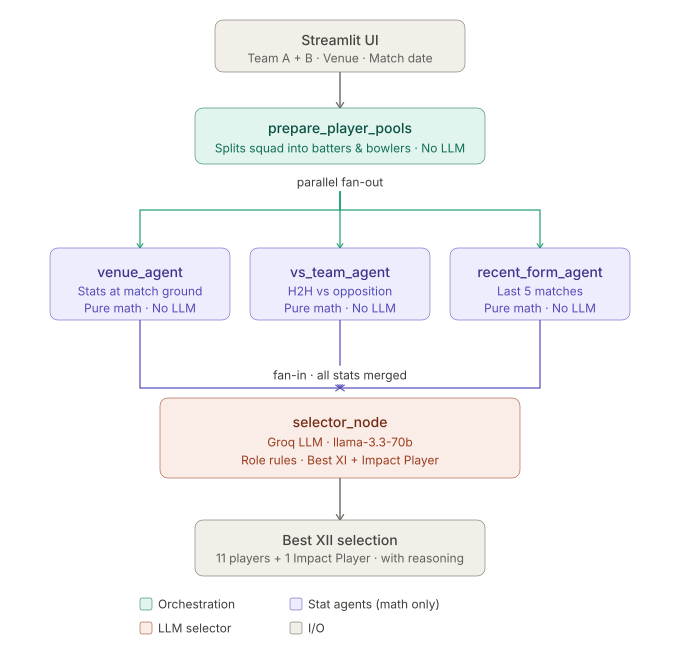

# CricketIQ — AI Best XI Selector

An AI-powered multi-agent system that picks the optimal playing XI (+ 1 Impact Player) for any IPL match, combining venue history, opposition head-to-head records, and recent form — powered by LangGraph and Groq.

---

## Architecture



The system is a LangGraph graph with a **fan-out / fan-in** pattern:

```
Input: combined player pool (22 players) + Venue City + Match Date
                          │
                ┌─────────▼──────────┐
                │  prepare_player_pools  │  ← Entry node (pure Python, no LLM)
                │                    │     Splits pool into team_a / team_b
                │                    │     × batters / bowlers by role
                └──────────┬─────────┘
                           │  3-way parallel fan-out
          ┌────────────────┼────────────────────┐
          ▼                ▼                    ▼
  ┌──────────────┐  ┌─────────────┐   ┌──────────────────┐
  │ venue_agent  │  │vs_team_agent│   │recent_form_agent │
  │ city stats   │  │ vs opponent │   │ last 5 matches   │
  │ pure math    │  │ pure math   │   │ pure math        │
  └──────┬───────┘  └──────┬──────┘   └────────┬─────────┘
         └──────────────────┴──────────────────┘
                        ▼  fan-in
               ┌────────────────────┐
               │   selector_node    │  ← LLM (Groq) — only LLM in the graph
               │  role constraints  │  1+ WK, 3+ Batters, 3+ Bowlers,
               │  + justification   │  1+ All-rounder, max 7 from one team
               │  selects 12 players│  (11 + 1 Impact Player)
               └────────────────────┘
```

**Key design principle:** Only the final `selector_node` uses an LLM. All stat collection and scoring is deterministic Python.

---

## Folder Structure

```
application/src/
├── team_selector.py                      # Streamlit page — entry point for this feature
├── team_selector_components/
│   ├── main.py                           # LangGraph graph definition (StateGraph, edges)
│   ├── nodes.py                          # All 5 node functions + Pydantic models + State
│   ├── prompts.py                        # System/user prompt templates for selector_node
│   └── tools.py                         # (reserved for future tool-calling expansion)
├── stats/
│   └── metrics/
│       ├── batter_metrics.py             # batter_at_venue_stats, batter_vs_team_stats,
│       │                                 # batter_recent_form_stats, batter_vs_bowler_stats
│       └── bowler_metrics.py             # bowler_at_venue_stats, bowler_vs_team_stats,
│                                         # bowler_recent_form_stats
└── utils/
    └── llm.py                            # Groq client + 3-model fallback chain
```

Flat-file data used by the selector:

```
ipl-dataset-2008-to-2025/
├── ball_by_ball_data.csv    # Source for all metrics (venue, H2H, recent form)
├── ipl_matches_data.csv     # Match metadata
└── players-data-updated.csv # Player roles (Batter, Bowler, All-rounder, Wicketkeeper-Batter)

application/src/stats/
└── ipl_venue_cities.csv     # Venue → city mapping for the city picker
    ipl_2026_squads.json     # IPL 2026 squad data with probableXi flags
```

---

## Node Breakdown

### 1. `prepare_player_pools` — orchestration / pre-processing
- Splits `combined_pool` (22 players from Streamlit UI) into `team_a` / `team_b` × `batters` / `bowlers`
- Role assignment: `{Batter, All-rounder, Wicketkeeper-Batter}` → batters; `{Bowler, All-rounder}` → bowlers
- Pure Python — no LLM

### 2. `venue_agent` — ground/city performance
- Calls `get_batter_at_venue_stats(batter, city)` and `get_bowler_at_venue_stats(bowler, city)`
- Players with no historical data at the venue are silently skipped
- Sorts by `impact_score` descending, keeps top 7 batters + top 7 bowlers

### 3. `vs_team_agent` — opposition head-to-head
- Team A batters face Team B (their opposition) and vice versa
- Calls `get_batter_vs_team_stats(batter, team)` and `get_bowler_vs_team_stats(bowler, team)`
- Sorts by `impact_score` descending, keeps top 7 batters + top 7 bowlers

### 4. `recent_form_agent` — last 5 matches
- Calls `get_batter_recent_form_stats(batter, num_matches=5)` and `get_bowler_recent_form_stats`
- Computes runs, SR, avg (batters) and economy, wickets (bowlers) over that window
- Sorts by `impact_score` descending, keeps top 7 batters + top 7 bowlers

### 5. `selector_node` — LLM-powered final selection
- Receives venue / vs-team / recent-form stats as formatted pipe-delimited strings
- Applies role constraints: 1+ WK, 3+ Batters, 3+ Bowlers, 1+ All-rounder, max 7 from one team
- Produces **12 players** (11 starters + 1 Impact Player) with per-player justification citing key stats
- Falls back to `MOCK_LLM_RESPONSE` if `MOCK_LLM=true` env var is set

---

## Impact Score Formula

Computed in `stats/metrics/batter_metrics.py` and `bowler_metrics.py`:

```python
# Batter
impact_score = (avg + 1) * (strike_rate / 100)

# Bowler
impact_score = (wickets_per_match * 10) + (1 / economy)
```

Agents rank players by `impact_score` and pass the top-N as raw text to the LLM. The LLM does the final synthesis — there is no aggregation or normalization between agents and the selector.

---

## LLM Strategy

| Layer | Implementation | Why |
|---|---|---|
| Orchestration / pool prep | No LLM — pure Python | Flow is fixed and deterministic |
| Individual stat scoring | No LLM — `impact_score` formula | Faster, cheaper, reproducible |
| Final XII selection + justification | Groq (prod) / LM Studio (local) | Needs constrained reasoning + natural language |

**Production (Groq)** — fallback chain in order of preference:
1. `llama-3.3-70b-versatile`
2. `llama-3.1-8b-instant`
3. `llama3-8b-8192`

On `RateLimitError` the chain automatically tries the next model. Raises `AllModelsRateLimitedError` if all are exhausted — surfaced gracefully in the Streamlit UI.

**Local (LM Studio)** — any locally running model at `http://localhost:1234/v1`.

**Testing** — set `MOCK_LLM=true` to skip the LLM entirely and return a hardcoded 12-player response.

---

## Setup

### 1. Environment Variables

Add these to your `.env` (in addition to the main app vars):

```env
GROQ_API_KEY=your_groq_api_key_here   # required for prod LLM calls
ENV=local                              # set to "prod" to use Groq; "local" uses LM Studio
MOCK_LLM=false                         # set to "true" to bypass LLM entirely (testing)
```

Get a free Groq API key at [console.groq.com](https://console.groq.com).

For local development with LM Studio, download any compatible model and start the local server at `http://localhost:1234/v1`.

### 2. Run the Selector Page

The Best XI Selector is a separate Streamlit page. From the project root:

```bash
streamlit run application/src/team_selector.py
```

Or if running the main app (`app.py`), navigate to the **Best XI Selector** page in the sidebar.

### 3. Using the Selector

1. **Pick Team A and Team B** — choose from IPL 2026 squads (players pre-selected based on `probableXi` flag)
2. **Select the venue city** from the dropdown
3. Click **"Let AI Pick the Best 11 + 1"**
4. View the selected XII with role icons, team colors, and AI reasoning
5. Expand **"Stats used by AI"** to see the raw venue / opposition / recent form data across 3 tabs

---

## Pydantic Models (`nodes.py`)

| Model | Fields | Purpose |
|---|---|---|
| `SessionData` | `combined_pool`, `team_a`, `team_b`, `match_city` | Input validation from Streamlit session |
| `Team` | `batters: list[dict]`, `bowlers: list[dict]` | Per-team player pools |
| `PlayerPools` | `team_a: Team`, `team_b: Team` | Output of `prepare_player_pools` |
| `State` (TypedDict) | `input`, `venue_scores`, `vs_team_scores`, `recent_form_scores`, `results`, `player_pools`, `final_choice` | LangGraph graph state |

---

## Known Gaps / Future Work

| Gap | Detail |
|---|---|
| Per-player parallel fan-out | Current nodes loop sequentially; could use LangGraph `Send` API for lower latency on large pools |
| Matchup agent | `batter_vs_bowler_stats(batter, bowler)` tool exists but no agent node uses it — useful for specific H2H signals |
| Normalized score aggregator | A 0-100 normalization layer between agents and the selector would make the LLM prompt more structured |
| Pool size cap | No enforced cap on combined pool size; very large pools may exceed LLM context window |
